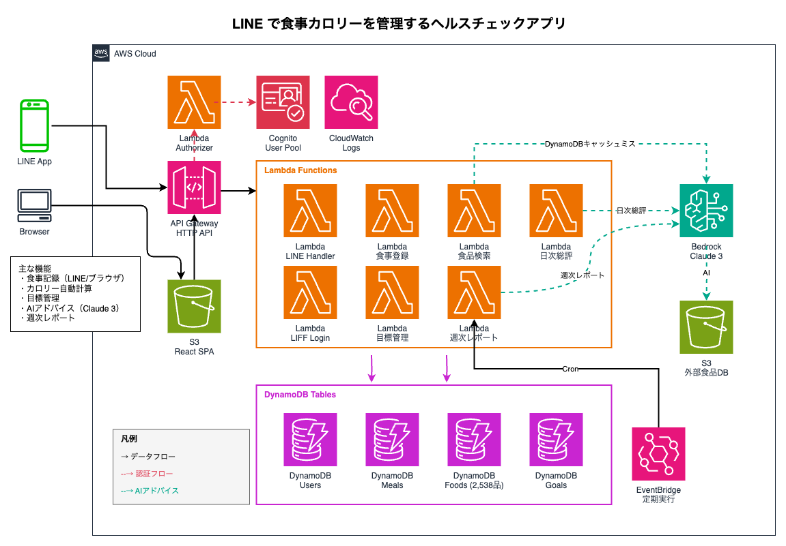

# LINE で食事カロリーを管理するヘルスチェックアプリ（開発版）

LINE から手軽に食事を記録し、カロリーと栄養バランスを自動計算。AI が毎日の食生活にアドバイスを提供します。

## 主な機能

| 機能 | 説明 |
|------|------|
| **食事記録** | LINE またはブラウザから食事を登録。食品名を入力するだけで栄養情報を自動取得 |
| **カロリー自動計算** | 日本食品標準成分表（2,538品目）をベースに正確なカロリー・栄養素を計算 |
| **目標管理** | 体重目標を設定し、目標達成に必要な1日の摂取カロリーを算出 |
| **AI アドバイス** | Claude 3 が1日の食事内容を分析し、改善ポイントをアドバイス |
| **週次レポート** | 1週間の食事傾向をまとめてレポート |

## システムの特徴

| 特徴 | 説明 |
|------|------|
| **ID 連携認証** | LINE ID と Cognito を統合。LINE ユーザーはシームレスに、ブラウザユーザーはメールアドレスでアカウント管理 |
| **完全サーバーレス** | Lambda + DynamoDB + S3 で構成。固定費ゼロ、従量課金のみでコストを極小化 |
| **生成 AI 活用** | Amazon Bedrock（Claude 3）を3つの機能で活用：①日次総評（1日の食事分析とアドバイス）、②週次レポート（週間統計とアドバイス）、③AI食品検索（DynamoDB未登録時にS3のCSVからAIが栄養情報を抽出） |
| **IaC による再現性** | Terraform で全インフラをコード管理。環境構築の自動化と構成のバージョン管理を実現 |
| **E2E テスト自動化** | Playwright + AWS Device Farm で実機モバイルブラウザテストを CI/CD に統合 |
| **公的データ活用** | 日本食品標準成分表（2,538 品目）を搭載し、信頼性の高い栄養計算を提供 |

## アーキテクチャ



## 技術スタック

- **インフラ管理**: Terraform
- **コンピューティング**: AWS Lambda (Python 3.11)
- **API**: AWS API Gateway (REST API)
- **データベース**: Amazon DynamoDB
- **ストレージ**: Amazon S3
- **認証**: Amazon Cognito, LINE LIFF (LINE Front-end Framework)
- **AI**: Amazon Bedrock (Claude 3)
- **CDN**: Amazon CloudFront
- **スケジューラ**: Amazon EventBridge (定期実行タスク)
- **画像認識**: Amazon Rekognition / Amazon Textract
- **メッセージング**: LINE Messaging API
- **ロギング**: Amazon CloudWatch Logs
- **E2Eテスト**: AWS Device Farm (モバイルブラウザテスト)
- **フロントエンド**: React (TypeScript)
- **AI 開発支援**: Claude Code

## プロジェクト構成

```
.
├── terraform/              # Terraformインフラ定義
│   ├── provider.tf        # プロバイダー設定
│   ├── variables.tf       # 変数定義
│   ├── dynamodb.tf        # DynamoDBテーブル定義
│   ├── s3.tf              # S3バケット定義
│   ├── cognito.tf         # Cognito User Pool定義
│   ├── cognito_triggers.tf # Cognito Lambda Triggers
│   ├── cloudfront.tf      # CloudFront CDN定義
│   ├── iam.tf             # IAMロールとポリシー定義
│   ├── api_gateway.tf     # API Gateway定義
│   ├── eventbridge.tf     # EventBridgeスケジュール定義
│   ├── device-farm.tf     # AWS Device Farm設定
│   ├── monitoring.tf      # CloudWatch監視設定
│   └── outputs.tf         # 出力定義
├── src/
│   └── lambda/            # Lambda関数
│       ├── common/        # 共通ライブラリ
│       │   └── auth.py    # 認証ヘルパー（Cognito/LINE両対応）
│       ├── authorizer/    # API Gateway Lambda Authorizer
│       ├── line_handler/  # LINE Webhook Handler
│       ├── liff_login/    # LIFF → Cognito Custom Auth
│       ├── define_auth_challenge/   # Cognito: チャレンジ定義
│       ├── create_auth_challenge/   # Cognito: チャレンジ生成
│       ├── verify_auth_challenge/   # Cognito: LINE ID Token検証
│       ├── post_confirmation/       # Cognito: ユーザー作成後処理
│       ├── meal_registration/  # 食事登録・ユーザー管理
│       ├── food_search/   # 食品検索
│       ├── daily_summary/ # 1日の総評とAIアドバイス
│       ├── goal_management/  # 体重目標管理
│       ├── weekly_report/ # 週次レポート生成
│       ├── food_master_import/  # 食品マスタインポート
│       └── test_user_management/  # テストユーザー管理
├── frontend/              # Reactフロントエンド
│   ├── src/              # ソースコード
│   │   ├── api/          # APIクライアント
│   │   ├── assets/       # 静的アセット
│   │   ├── components/   # UIコンポーネント
│   │   ├── contexts/     # Reactコンテキスト
│   │   │   ├── AuthContext.tsx        # Cognito認証
│   │   │   ├── LiffContext.tsx        # LINE LIFF認証
│   │   │   └── UnifiedAuthContext.tsx # 統合認証コンテキスト
│   │   ├── hooks/        # カスタムフック
│   │   ├── pages/        # ページコンポーネント
│   │   ├── types/        # TypeScript型定義
│   │   └── utils/        # ユーティリティ関数
│   ├── e2e/              # E2Eテスト（Playwright）
│   │   ├── auth.spec.ts           # 認証テスト
│   │   ├── critical-path.spec.ts  # クリティカルパステスト
│   │   ├── food-search.spec.ts    # 食品検索テスト
│   │   ├── goals.spec.ts          # 目標管理テスト
│   │   ├── meal-registration.spec.ts  # 食事登録テスト
│   │   ├── meals.spec.ts          # 食事一覧テスト
│   │   ├── profile.spec.ts        # プロフィールテスト
│   │   └── summary.spec.ts        # サマリーテスト
│   └── package.json      # npm設定
├── tests/                 # Pythonテスト（ユニット/統合/プロパティ）
│   ├── conftest.py       # 共通フィクスチャ
│   └── test_*.py         # テストファイル群
├── scripts/               # ユーティリティスクリプト
├── docs/                  # ドキュメント
│   ├── ARCHITECTURE.md   # アーキテクチャ概要
│   ├── API_SPECIFICATION.md  # API仕様書
│   ├── DEPLOYMENT.md     # デプロイ手順
│   ├── DEVICE_FARM_SETUP.md  # Device Farm設定ガイド
│   └── USER_TEST_GUIDE.md    # ユーザーテストガイド
├── .github/
│   └── workflows/        # GitHub Actions
│       └── device-farm.yml  # Device Farm E2Eテストワークフロー
└── README.md
```

## セットアップ手順

### 前提条件

- AWS CLI がインストールされ、設定されていること
- Terraform >= 1.0 がインストールされていること
- Python 3.11 がインストールされていること
- Node.js >= 18 がインストールされていること
- AWS アカウントと適切な権限

### 1. リポジトリのクローン

```bash
git clone <repository-url>
cd meal-management-app
```

### 2. Terraform 変数の設定

```bash
cd terraform
cp terraform.tfvars.example terraform.tfvars
# terraform.tfvars を編集して実際の値を設定
```

### 3. Terraform の初期化と適用

```bash
terraform init
terraform plan
terraform apply
```

このステップで以下のリソースが作成されます：

- DynamoDB テーブル（Users, Meals, Foods, Goals, AdviceUsage）
  - **Foods テーブル**: 日本食品標準成分表（2,538品目）と外部API検索結果のキャッシュを保存
- S3 バケット（terraform-state, barcode-images, frontend）
  - 食品マスタは DynamoDB をプライマリ使用（要求ベース課金で効率的）
- Cognito User Pool と User Pool Client
- Lambda 実行用 IAM ロール
  - DynamoDB、S3、Bedrock、Rekognition へのアクセス権限
  - **Lambda 間呼び出し権限**: LINE Handler → Daily Summary 等
- API Gateway CloudWatch ロール

### 4. Python 依存関係のインストール

```bash
cd ../src/lambda
pip install -r requirements.txt
```

### 5. フロントエンドのセットアップ

```bash
cd ../../frontend
npm install

# 環境変数ファイルを作成
cp .env.example .env
# .env を編集して以下を設定:
# - VITE_API_BASE_URL: API Gateway URL（terraform outputsから取得）
# - VITE_COGNITO_USER_POOL_ID: Cognito User Pool ID（terraform outputsから取得）
# - VITE_COGNITO_CLIENT_ID: Cognito Client ID（terraform outputsから取得）
```

## 開発

### バックエンド開発

#### ローカルテスト

```bash
# ユニットテストの実行
pytest tests/

# プロパティベーステストの実行
pytest tests/ -k property

# 統合テストの実行
pytest tests/ -m integration

# カバレッジ付きでテスト実行
pytest tests/ --cov
```

#### Lambda関数のパッケージング

```bash
# Lambda関数をZIPファイルにパッケージング
bash scripts/package_lambda.sh
```

### フロントエンド開発

```bash
cd frontend

# 開発サーバーの起動（http://localhost:5173）
npm run dev

# プロダクションビルド
npm run build

# E2Eテストの実行
npm run test:e2e              # ヘッドレスモード
npm run test:e2e:ui           # UIモード（インタラクティブ）
npm run test:e2e:headed       # ブラウザを表示して実行

# Linting
npm run lint
```

詳細なフロントエンド開発ガイドは [frontend/README.md](frontend/README.md) を参照してください。

### デプロイ

```bash
cd terraform
terraform apply
```

## 環境変数

### バックエンド（Terraform変数）

`terraform/terraform.tfvars` に設定:

- `environment`: 環境名（dev / staging / prod）
- `aws_region`: AWS リージョン（デフォルト: ap-northeast-1）
- `line_channel_secret`: LINE Messaging API Channel Secret
- `line_channel_access_token`: LINE Messaging API Channel Access Token

### フロントエンド（frontend/.env）

- `VITE_API_BASE_URL`: API Gateway URL
- `VITE_COGNITO_USER_POOL_ID`: Cognito User Pool ID
- `VITE_COGNITO_CLIENT_ID`: Cognito Client ID
- `VITE_LIFF_ID`: LINE LIFF アプリケーション ID（LIFF認証使用時）

## LINE Bot アーキテクチャ

LINE Bot は以下の Lambda 関数連携で動作します：

```
LINE App → API Gateway → line_handler → daily_summary (総評機能)
                                      → food_search (食品検索)
```

**重要な設計ポイント:**
- Lambda 関数名は Terraform で動的生成（`${project}-${env}-${name}` 形式）
- 関数名はハードコードせず、環境変数で渡す
- Lambda 間呼び出しには IAM の `lambda:InvokeFunction` 権限が必要

詳細は [docs/ARCHITECTURE.md](docs/ARCHITECTURE.md) を参照。

## 認証アーキテクチャ

本アプリケーションは **Cognito User Pool** を認証基盤として、LINE ユーザーとブラウザユーザーを統合管理しています。

### 統合認証基盤

```
┌─────────────────────────────────────────────────────────────┐
│                    Cognito User Pool                         │
│              (統一された user_id で管理)                      │
├─────────────────────────────────────────────────────────────┤
│                                                               │
│  【LINE ユーザー】              【ブラウザユーザー】            │
│   LIFF SDK                      Cognito Hosted UI            │
│       ↓                              ↓                        │
│   LINE ID Token                 Email/Password               │
│       ↓                              ↓                        │
│   Custom Auth Flow              Standard Auth                 │
│   (Lambda Triggers)                                           │
│       ↓                              ↓                        │
│   ─────────── Cognito JWT Token ───────────                  │
│                      ↓                                        │
│              API Gateway                                      │
│         (Lambda Authorizer)                                   │
│                      ↓                                        │
│              Lambda Functions                                 │
└─────────────────────────────────────────────────────────────┘
```

### LINE ID 連携の仕組み

LINE ユーザーは **Cognito Custom Auth Flow** を通じて認証されます：

1. LIFF SDK で LINE ID Token を取得
2. `/auth/liff-login` API で Custom Auth を開始
3. Lambda Triggers が LINE ID Token を検証
4. 検証成功後、Cognito JWT Token を発行

これにより、LINE ユーザーもブラウザユーザーも同じ Cognito JWT Token で API にアクセスします。

### 認証の自動切り替え

フロントエンドは実行環境を自動検出し、適切な認証フローを選択します：

- **LIFF 環境**: LINE ID Token → Cognito Custom Auth → JWT
- **ブラウザ**: Email/Password → Cognito Standard Auth → JWT

## ドキュメント

- [アーキテクチャ](docs/ARCHITECTURE.md) - システム構成と設計思想
- [API 仕様書](docs/API_SPECIFICATION.md) - REST API エンドポイント一覧
- [デプロイ手順](docs/DEPLOYMENT.md) - AWS へのデプロイ方法
- [Device Farm 設定](docs/DEVICE_FARM_SETUP.md) - E2E テスト環境構築
- [フロントエンド開発ガイド](frontend/README.md) - React アプリ開発

---

## 【参考】コスト比較：サーバーレス vs IaaS

本アプリケーションと同等の機能を従来型（IaaS）で構築した場合との月額コスト比較です。

### 前提条件

- アクティブユーザー: 100人/月
- API リクエスト: 30,000 回/月（1人あたり300回）
- データ保存: 1GB
- AI アドバイス生成: 1,000 回/月

### コスト比較表

| 項目 | サーバーレス構成 | IaaS 構成 |
|------|-----------------|-----------|
| **コンピューティング** | Lambda: ~$0.50 | EC2 t3.small (24h): ~$15 |
| **データベース** | DynamoDB: ~$1.25 | RDS db.t3.micro: ~$15 |
| **ストレージ** | S3: ~$0.03 | EBS 20GB: ~$2 |
| **認証** | Cognito: 無料枠内 | EC2 + Redis: ~$15 |
| **CDN** | CloudFront: ~$1 | CloudFront: ~$1 |
| **AI** | Bedrock: ~$5 | Bedrock: ~$5 |
| **合計** | **~$8/月** | **~$53/月** |

> ※ 上記は ap-northeast-1 リージョンの参考価格。実際の料金は使用量により変動します。

### サーバーレスのメリット

| メリット | 説明 |
|----------|------|
| **固定費ゼロ** | 使用した分だけ課金。アクセスがなければ費用発生なし |
| **自動スケーリング** | トラフィック急増時も自動でスケールアウト |
| **運用負荷軽減** | OS パッチ、セキュリティ更新が不要 |
| **高可用性** | マルチ AZ 構成がデフォルト |
| **開発効率** | インフラ管理不要でビジネスロジックに集中 |

### サーバーレスが適するケース

```
✅ トラフィックが予測困難、または変動が大きい
✅ 小〜中規模のアプリケーション（MAU 10万以下目安）
✅ 開発・運用リソースが限られている
✅ MVP やプロトタイプの迅速な構築
✅ イベント駆動型の処理（Webhook、バッチ処理）
✅ コスト最適化を重視するスタートアップ・個人開発
```

### IaaS への移行を検討すべき判断基準

以下の条件に該当する場合、IaaS（EC2/ECS/EKS）への移行を検討してください：

| 判断基準 | 目安 |
|----------|------|
| **リクエスト量** | 月間 1,000万リクエスト超でLambda コストが EC2 を上回る |
| **実行時間** | 1 リクエストの処理が 15 分超（Lambda 上限） |
| **コールドスタート** | レイテンシ要件が厳しい（p99 < 100ms） |
| **ステートフル処理** | WebSocket 常時接続、長時間セッション |
| **特殊な依存** | GPU、大容量メモリ、特定の OS/ライブラリ |
| **コスト** | 常時高負荷で Lambda 課金が月額 $500 超 |

### 本プロジェクトでサーバーレスを採用した理由

1. **個人開発での運用負荷最小化**: サーバー監視・メンテナンスが不要
2. **コスト予測可能性**: 使用量に応じた従量課金で固定費リスクなし
3. **スケーラビリティ**: ユーザー増加時も自動対応
4. **AWS サービス連携**: Cognito, Bedrock, DynamoDB とのネイティブ統合
5. **Terraform による再現性**: IaC でインフラを完全にコード管理

---

## 作成者

**Naoya Iimura**

ネットワークセールスエンジニア / 個人開発エンジニア / ウェブマーケター

📧 info@kuma8088.com

---

## ライセンス

MIT License
